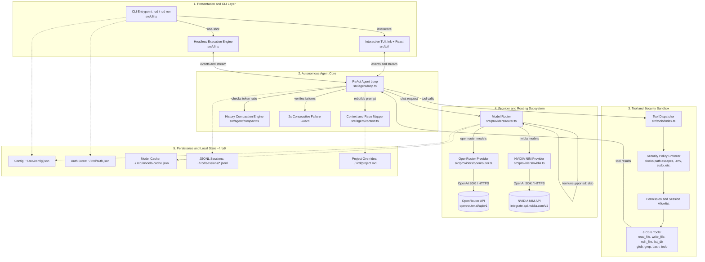
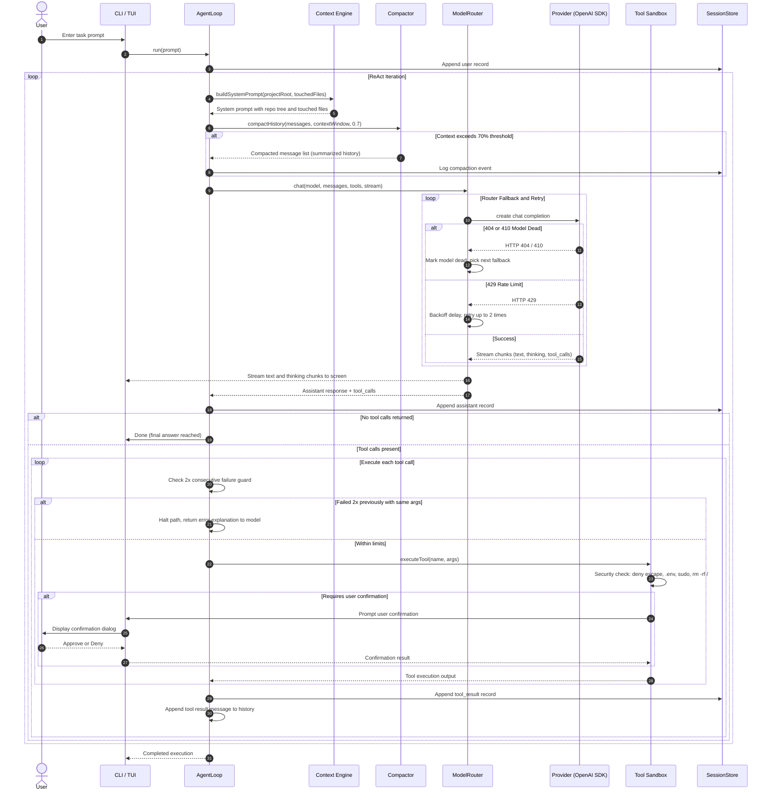

```text
╭─────────────────────────────────────────────────────────────────────────╮
│  █▀█ █▀█ █ █ ▀█▀ █▀▀ █▀█   █▀▀ █▀█ █▀▄ █▀▀           [ rcd ] v0.1.0 ⚡  │
│  █▀▄ █▄█ █▄█  █  ██▄ █▀▄   █▄▄ █▄█ █▄▀ ██▄     Autonomous Coding Agent  │
╰─────────────────────────────────────────────────────────────────────────╯
```

# routercode (rcd)

A local, autonomous terminal coding agent. Run `rcd` inside any project folder, type your task, and the agent inspects the codebase, edits files with exact precision, executes bash commands, and iterates autonomously until the task is done.

## Quick Install

Install the standalone binary directly via curl (no Node.js required):

```bash
curl -fsSL https://raw.githubusercontent.com/dilkuwor/routercode/main/install.sh | bash
```

Then:
1. **Restart your terminal** (or run `source ~/.zshrc` / `source ~/.bashrc`).
2. Run `rcd login openrouter` or `rcd login nvidia` to store your API keys.
3. Run `rcd` inside any project to launch the interactive terminal agent!

> **Note:**
> - Node/npm is only needed for local development.
> - Docker is optional for running in isolated test environments.
> - `deepseek-ai/deepseek-v4-flash` is retired; do not use it.

---

## Architecture Diagram



---

## Detailed ReAct Loop Execution Flow



---

## Component Details & How It Works

### 1. Presentation & CLI Layer (`src/cli.ts` & `src/tui/`)
- **CLI Dispatcher (`src/cli.ts`)**:
  - Parses terminal arguments: `rcd`, `rcd run "<task>"`, `rcd login <provider>`, and `rcd models`.
  - In headless mode (`rcd run`), runs the agent without TUI overhead, streaming tokens and tool status directly to `process.stdout`/`process.stderr`.
  - Interactively requests API keys on `rcd login` and auto-refreshes model metadata.
- **Terminal User Interface (`src/tui/`)**:
  - Built with **Ink (React for terminal CLIs)**.
  - **Header Component (`Header.tsx`)**: Displays the stylish ASCII block logo (`routercode [ rcd ]`), active model name, active provider, unique session ID, current project path, and auto-approve badge.
  - **Tool Cards (`ToolCard.tsx`)**: Visual cards rendering tool name, inputs (target file or command), execution state (running/done/error), and live output previews.
  - **Input & Keyboard Controls (`App.tsx`)**: Seamless input handling, slash command interception, interactive confirmation prompts (Y/N), and `Ctrl+C` interrupt handling (aborts running loops without terminating the process; exits if idle).

### 2. Autonomous ReAct Loop (`src/agent/loop.ts`)
- Implements the **Thought $\rightarrow$ Action $\rightarrow$ Observation $\rightarrow$ Reflection** loop.
- **State Machine**:
  - Maintains conversation history, session identifiers, touched files, session-approved files, and task checklists.
  - Terminates automatically when the model completes the task without proposing further tool calls, when max step limit (default: 30) is reached, or when the user aborts.
- **Loop Guardrails**:
  - Tracks consecutive failures per tool + arguments combination. If the exact same call fails twice consecutively, the loop halts that branch and forces the model to explain the failure and pivot to an alternate solution.

### 3. Context & Prompt Assembly (`src/agent/context.ts`)
- **Dynamic Repository Map**:
  - Recursively scans the project workspace up to 4 directory levels deep, filtering out noise (`.git`, `node_modules`, `dist`, `.rcd`, `coverage`).
  - Presents an up-to-date ASCII file tree to the model on every iteration.
- **Session Touched Files**:
  - Tracks every file created or modified in the current session and reminds the model of files currently in flux.
- **Project Overrides (`./.rcd/project.md`)**:
  - If a local `./.rcd/project.md` file exists in the repository, its contents are injected into the system prompt to guide project-specific conventions, code standards, and workflows.

### 4. History Compaction Engine (`src/agent/compact.ts`)
- Uses token estimation to prevent context window overflow.
- When message history exceeds **~70% of the model's context capacity**:
  - Retains the system prompt and the user's root objective.
  - Retains the most recent 6 messages to preserve active working memory.
  - Condenses intermediate tool turns, observations, and agent thoughts into a structured summary block (`[CONVERSATION HISTORY COMPACTED]`).
  - Replaces older turns with the summary, reclaiming token space while preserving key context.

### 5. Tool System & Security Sandbox (`src/tools/index.ts`, `definitions.ts`)
Only 8 core tools are available to prevent unexpected behavior:
1. `read_file(path, start?, end?)`: Line-numbered, ranged file reading.
2. `write_file(path, content)`: Creates or completely rewrites files. Requires confirmation.
3. `edit_file(path, old, new)`: Performs exact search-and-replace. **Fails if `old` is missing or not unique in the file.**
4. `list_dir(path)`: Explores directories.
5. `glob(pattern)`: Fast file matching using Node 22 native `fs.globSync`.
6. `grep(pattern, glob?)`: High-speed text search using `ripgrep` (`rg`) if installed, with a native recursive Node.js fallback.
7. `bash(command)`: Executes shell commands in the project root with a 60-second timeout and output truncation.
8. `todo(items)`: Tracks checklists and task progress.

#### Security & Permission Enforcement
- **Deny-by-default on sensitive assets**:
  - Blocks any path escaping outside the project root (`../`).
  - Blocks file and bash access to `.env`, `.env.*`, `~/.ssh`, and `*.pem` credentials.
  - Blocks dangerous shell operations: `sudo`, `rm -rf /`, `curl | sh`, `wget | bash`.
- **Pre-approved Bash Commands**: `ls`, `pwd`, `rg`, `git status`, `git diff`, `npm test`, `npx vitest`.
- **Session-level file permissions**: Once a file edit is approved by the user, subsequent edits to that same file are permitted for the duration of the session.

### 6. Provider Routing & Resilience Layer (`src/providers/`)
- Unified interface conforming to OpenAI SDK specifications: `chat({ model, messages, tools, stream })`.
- **Router Policy (`router.ts`)**:
  1. Starts with user-selected or default model.
  2. **404 / 410 Handling**: If a model returns 404 or 410, marks the model as dead in `~/.rcd/models-cache.json` and automatically transitions to the next fallback model.
  3. **429 Rate Limit Handling**: Applies exponential backoff and retries up to 2 times before switching to the next fallback.
  4. **Tool Compatibility Check**: If a model rejects tool calling parameters, skips to the next capable model.
- **OpenRouter (`openrouter.ts`)**:
  - Base URL: `https://openrouter.ai/api/v1`
  - Default: `openrouter/free`
  - Caches zero-cost models that support function calling.
- **NVIDIA NIM (`nvidia.ts`)**:
  - Base URL: `https://integrate.api.nvidia.com/v1`
  - Pre-blocks retired models (`deepseek-ai/deepseek-v4-flash`).
  - Prioritizes live models: `nvidia/nemotron-3-super-120b-a12b`, `nvidia/nemotron-3-ultra-550b-a55b`, and `deepseek-ai/deepseek-v4-flash-0731`.

### 7. Storage & Auditing (`src/store/session.ts` & `src/config.ts`)
- **Sessions Directory (`~/.rcd/sessions/<id>.jsonl`)**:
  - Every interaction, tool invocation, shell output, and error is stored in append-only JSON Lines format for auditing, debugging, and review.
- **Config & Auth (`~/.rcd/config.json`, `~/.rcd/auth.json`)**:
  - Stores user preferences, default models, fallback chains, confirmation toggles, and API keys with secure local filesystem permissions.

---

## Commands & Slash Commands

### CLI Commands
```bash
rcd                  # Start interactive TUI in current directory
rcd -y               # Start TUI with Auto-Approve ON (no permission prompts)
rcd run "task"       # One-shot headless execution without TUI
rcd run "task" -y    # Run headless with Auto-Approve (no permission prompts)
rcd login openrouter # Configure OpenRouter API key and cache free/tool models
rcd login nvidia     # Configure NVIDIA NIM API key and cache live models
rcd models           # Display active model, fallbacks, and cached model IDs
```

### TUI Slash Commands
Type these commands into the prompt bar during an interactive `rcd` session:
- `/models` — Display active model, fallback sequence, and cached models.
- `/provider [openrouter|nvidia]` — Show or switch active provider.
- `/confirm [on|off]` — Toggle permission prompts / Auto-Approve on the fly.
- `/new` — Reset the session, clear working memory, and generate a new session ID.
- `/compact` — Manually trigger history compaction to reclaim token headroom.
- `/diff` — Run `git diff` and display current uncommitted changes.
- `/stop` — Abort the currently running agent loop.

---

## Configuration Schema

Default configuration stored in `~/.rcd/config.json`:

```json
{
  "defaultProvider": "openrouter",
  "defaultModel": "openrouter/free",
  "fallbackModels": [
    "nvidia/nemotron-3-super-120b-a12b",
    "openai/gpt-oss-120b:free"
  ],
  "maxSteps": 30,
  "confirm": {
    "edit": true,
    "bash": true
  }
}
```

---

## Local Development & Testing

Node 22+ and npm are required only for local development:

```bash
# Clone repository
git clone https://github.com/dilkuwor/routercode.git
cd routercode

# Install dependencies
npm install

# Build CLI binary
npm run build

# Run unit and integration tests (Vitest)
npm test

# Test local build directly
npx rcd --help
node dist/cli.js run "explain this codebase"
```

---

## Docker (Isolated Environment)

`routercode` is available on **Docker Hub**: [**`dpksamir/routercode`**](https://hub.docker.com/r/dpksamir/routercode).

You can run `rcd` inside an isolated container without installing Node.js or modifying host system state. The Docker container mounts your current workspace at runtime and does not contain the user repository in the image.

### Run with Docker Hub Image

```bash
# Pull the latest image
docker pull dpksamir/routercode:latest

# Run inside any project directory
docker run --rm -it \
  -v "$PWD":/workspace \
  -w /workspace \
  -e OPENROUTER_API_KEY \
  -e NVIDIA_API_KEY \
  dpksamir/routercode
```

### Build and Run Locally

Alternatively, you can build the image directly from the included `Dockerfile`:

```bash
# Build local Docker image
docker build -t rcd .

# Run inside any workspace directory
docker run --rm -it \
  -v "$PWD":/workspace \
  -w /workspace \
  -e OPENROUTER_API_KEY \
  -e NVIDIA_API_KEY \
  rcd
```
